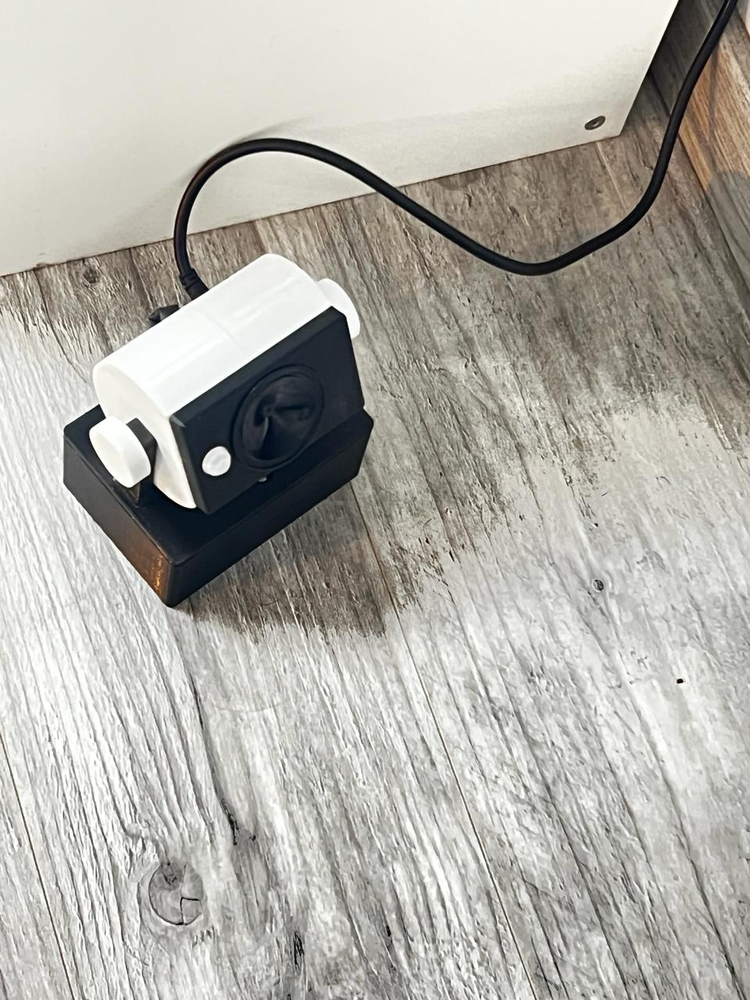
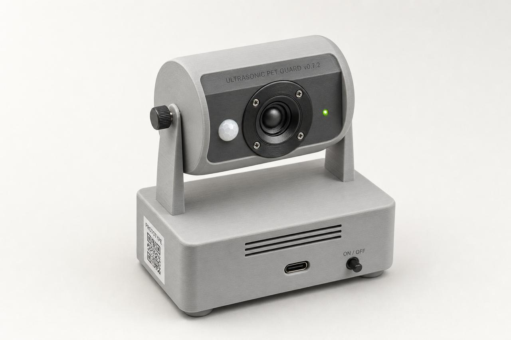

# Ultrasonic Pet Guard

An open-source, 3D-printed **ultrasonic deterrent for dogs and cats**, built around an ESP32. A PIR sensor watches a zone (a doorway, a couch, a corner the dog keeps marking); when it detects motion during the active hours, the device fires a short burst of loud **25 kHz** sound — inaudible to humans, very unpleasant to the animal — so the pet learns to stay away.

It is deliberately *loud*. The ESP32 drives the ultrasonic transducer through an L298N in a **full H-bridge** off a **12 V** supply, which is what makes the burst strong enough that a dog will actually break off and leave the zone rather than just twitch an ear.

| Real device | Concept render |
|---|---|
|  |  |

> ⚠️ **Use responsibly.** This is an aversive device. It is meant to keep a pet out of a specific spot, not to punish or harm. Only run it on the active-hours schedule, point it at the zone (not at where the animal rests/sleeps), and dial back the burst if your pet is simply distressed rather than redirected. Do not aim it at people or use it where it could affect other animals you don't intend to.

---

## How it works (and why it hits so hard)

Several design choices stack up to make the output far stronger than a typical AliExpress repeller:

- **Full H-bridge drive (±Vsupply instead of 0..Vsupply).** The L298N is driven with IN1 carrying the PWM and IN3 carrying the *inverted* PWM (routed through the ESP32 GPIO matrix). The transducer sees the full supply swing in *both* directions — that's 2× the voltage swing, ≈4× the acoustic power, **+6 dB** for free versus a single-ended driver.
- **12 V supply.** Running the H-bridge at 12 V (not 5 V) raises the SPL much further again — this is the single biggest reason the built device is so loud.
- **Hardware PWM (LEDC).** The 25 kHz square wave is generated by the ESP32's hardware timer, so the frequency is rock-steady with no software jitter.
- **25 kHz, chosen empirically.** Inaudible to humans (>20 kHz), well within a dog's hearing, and reproduced efficiently by a real ultrasonic piezo tweeter. 25 kHz gave the sharpest real-world reaction in testing.
- **Pulsed burst, not a steady tone.** 10 pulses of 300 ms with 150 ms gaps. The on/off pattern triggers a startle response and prevents the animal from habituating the way it would to a continuous tone.
- **Dedicated ultrasonic piezo transducer**, well sealed in the enclosure and aimed outward, so the energy goes into the room instead of leaking back inside the case.

See [`docs/HARDWARE.md`](docs/HARDWARE.md) for the parts list (BOM), wiring, and print settings.

## Features

- PIR-triggered 25 kHz ultrasonic burst (10 × 300 ms).
- **Web UI** over WiFi (`http://pet-guard.local/`) to set the active-hours window and fire a test burst.
- **NTP-synced schedule** (e.g. 21:00 → 07:00, may cross midnight), stored in NVS so it survives reboots.
- **Fail-safe:** if WiFi/NTP is unavailable, the device runs 24/7 instead of going dark.
- JSON status endpoint at `/api/status`.
- Tilting "drum head" on a friction-clamped M8 pivot bolt so you can aim it precisely.

## Repository layout

```
.
├── src/main.cpp                 ESP32 firmware (PlatformIO / Arduino framework)
├── include/
│   ├── config.example.h         WiFi credentials template — copy to config.h
│   └── config.h                 your local credentials (gitignored)
├── platformio.ini               PlatformIO project config
├── hardware/
│   ├── cad/                     Fusion 360 STEP export
│   └── print/                   ready-to-slice 3MF parts
├── docs/
│   ├── HARDWARE.md              BOM, wiring, and print settings
│   └── images/                  photos & renders
└── README.md
```

## Bill of materials

### Electronics

| Qty | Part | Notes |
|---|---|---|
| 1 | ESP32 DevKit (ESP32-WROOM-32) | the controller |
| 1 | L298N dual H-bridge module | drives the transducer in full H-bridge |
| 1 | AM312 PIR motion sensor | 3-pin (VCC / GND / OUT) |
| 1 | Wide-band piezo tweeter, Ø50 mm | pick a unit that reproduces well past 25 kHz (e.g. **~1–45 kHz**), **not** one capped at 25 kHz; bonded in with hot-melt glue |
| 1 | **12 V DC power adapter, ≥1–2 A** | powers the H-bridge at 12 V (high SPL) |
| 1 | **12 V barrel-jack socket** (panel mount, 5.5 × 2.1 mm) | power input on the enclosure |
| 1 | **DC-DC step-down (buck) converter — XL4015** | drops 12 V → 5 V for the ESP32, PIR, and L298N logic |
| ~3 m | Hookup wire (AWG 28–30) + heat-shrink | internal wiring harness |

> The build is powered by **12 V via the barrel jack**. The 12 V feeds the L298N motor supply (`Vs`) directly (for high SPL), while an **XL4015 buck converter steps 12 V down to 5 V**. That single 5 V rail powers the **ESP32 (`5V` pin), the PIR sensor (`VCC`), and the L298N logic (`+5V`)** — so the L298N's onboard 5 V regulator is not used (set the XL4015 output trimmer to 5 V before connecting anything). During flashing you can also power the ESP32 over USB.

> **Note:** the power LED and on/off switch visible in the concept render are **not** part of the current enclosure design (no cutouts or mounts, and the firmware does not drive an LED). Power is switched at the 12 V adapter. Add your own panel cutouts if you want them.

### 3D-printed parts (`hardware/print/`)

| File | Part |
|---|---|
| `body.3mf` | base shell (electronics bay) |
| `top-plate.3mf` | top plate / head module with yokes |
| `drum-left.3mf`, `drum-right.3mf` | drum-head halves |
| `front-panel.3mf` | front insert / chord face (PIR + transducer cutouts) |
| `bolt-holder.3mf` | tilt pivot / captured M8-nut holder |

Print in **PETG**, 0.2 mm layers, 100 % infill. Print settings and the part list are in [`docs/HARDWARE.md`](docs/HARDWARE.md).

### Fasteners & hardware

| Qty | Part | Notes |
|---|---|---|
| 2 | **M8 bolt** | tilt pivot — one through each yoke |
| 1 | **M8 extended (coupling) nut** | captured in one drum end; the M8 tilt bolt threads into it to clamp the tilt by friction (the other drum end is a plain Ø8 hole) |
| 4 | **M3 heat-set brass inserts** | top-plate / lid mounting |
| 6–8 | **Ø1.75 mm self-tapping plastic screws** | mounting the PCBs (ESP32 / L298N / XL4015) |
| 1 | cable grommet Ø5–6 mm | harness pass-through |
| 4 | self-adhesive rubber feet | base |
| — | **Hot-melt glue** | bonding the PIR sensor + tweeter inside the drum |
| — | **Superglue (CA)** | joining the two drum halves + the front panel |

## Firmware: build & flash (PlatformIO)

1. Install [PlatformIO](https://platformio.org/) (VS Code extension or `pip install platformio`).
2. Set your WiFi credentials (kept out of git):
   ```sh
   cp include/config.example.h include/config.h
   # then edit include/config.h with your SSID and password
   ```
   WiFi is optional — it is only used for NTP (the schedule) and the web UI. Without it the device runs 24/7.
3. Connect the ESP32 over USB and build + upload:
   ```sh
   pio run --target upload
   ```
4. Watch the serial log (optional):
   ```sh
   pio device monitor -b 115200
   ```

## Wiring / pinout

| Signal | ESP32 GPIO | To |
|---|---|---|
| PIR `OUT` | **27** | AM312 OUT |
| L298N `IN1` | **13** | H-bridge input (non-inverted PWM) |
| L298N `IN3` | **12** | H-bridge input (inverted PWM, via GPIO matrix) |
| L298N `ENA` (+`ENB`) | **14** | shared H-bridge enable |
| L298N `IN2`, `IN4` | — | **tie both to GND** (unused half-bridge inputs — must not float) |
| Transducer | — | across L298N **OUT1 ↔ OUT3** |
| 12 V rail | — | barrel jack → L298N `Vs` (motor supply) **and** → XL4015 buck input |
| 5 V rail (XL4015 `OUT`) | — | → ESP32 `5V`, → PIR `VCC`, **and** → L298N `+5V` logic |

The piezo is connected **between OUT1 and OUT3** (not to ground) — that is what gives the full H-bridge ±12 V swing. Only `IN1`/`IN3` are driven; the other two inputs `IN2` and `IN4` (which control the unused outputs OUT2/OUT4) must be **tied to GND** so they don't float and cause erratic switching.

## Using it

- Open **`http://pet-guard.local/`** (or the IP printed on the serial log) from any phone/laptop on the same network.
- Set the **active window** (default 21:00 → 07:00; it may cross midnight), toggle **Enabled**, and **Save** — the schedule is stored on the device.
- Hit **Test (fire burst now)** to verify the transducer. You won't hear the 25 kHz tone; confirm it with a spectrum-analyzer phone app, or just watch the pet's reaction.

## License

[MIT](LICENSE) — firmware, hardware files, and documentation. Build it, modify it, share it.
